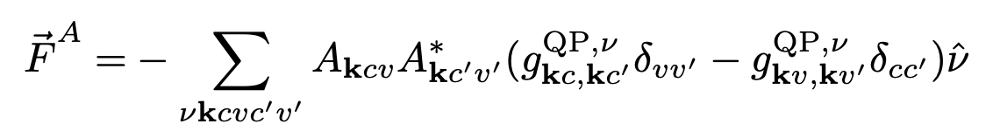
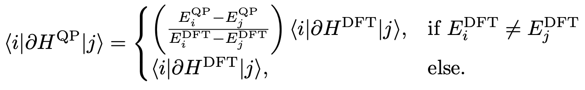

# Excited State Forces

## Overview

This code calculates excited state forces after electronic excitation using a many-body Green's function formalism. It combines exciton coefficients from the Bethe-Salpeter Equation (BSE) with electron-phonon coupling coefficients from DFPT to compute forces in excited states.

## Theory

The excited force expression is given by:



where:
- $\hat{\nu}$ is a displacement pattern (i.e. phonon mode)
- $A_{\mathbf{k}cv}$ are exciton coefficients from the Bethe-Salpeter Equation
- $g^{\nu}_{ki,kj}$ are electron-phonon coefficients connecting bands $i$ and $j$ at k-point $k$
- $c,v$ represent conduction and valence band indices
- $k$ represents k-point indices

The electron-phonon coefficients at GW level are computed using our approximation:



**For detailed implementation and benchmarks, see:** https://arxiv.org/abs/2502.05144


### External Software Dependencies

- **BerkeleyGW**: For GW/BSE calculations
- **Quantum ESPRESSO**: For DFT ground state and DFPT calculations


## Usage

### Basic Usage

1. **Prepare input files**: You need results from both GW/BSE and DFPT calculations
   - `eigenvectors.h5`: Exciton eigenvectors from BSE calculation
   - `eqp.dat`: Quasiparticle energies from GW calculation  
   - `*.phsave/`: Directory containing electron-phonon coupling data from DFPT

2. **Create a forces.inp file**:
```
iexc 1
eqp_file         eqp.dat
exciton_file     eigenvectors.h5
el_ph_dir        system.phsave/
```

3. **Run the calculation**:
```bash
python excited_forces.py
```

### Configuration Options

| Parameter | Description | Default |
|-----------|-------------|---------|
| `iexc` | Excited state index to calculate forces for | 1 |
| `jexc` | Second exciton index (for cross terms) | same as iexc |
| `factor_head` | Scaling factor for head of dielectric matrix | 1 |
| `ncbnds_sum` | Number of conduction bands in sum | all available |
| `nvbnds_sum` | Number of valence bands in sum | all available |
| `eqp_file` | Quasiparticle energies file | eqp.dat |
| `exciton_file` | BSE eigenvectors file | eigenvectors.h5 |
| `el_ph_dir` | Electron-phonon coupling directory | *.phsave/ |
| `save_elph_coeffs` | Save el-ph coefficients to HDF5 (needed for 2nd order Raman) | False |
| `load_elph_coeffs` | Load el-ph coefficients from HDF5 instead of recomputing | False |
| `just_save_elph_coeffs` | Stop after saving el-ph coefficients (skip force calculation) | False |
| `elph_coeffs_file_to_be_loaded` | HDF5 file to load el-ph coefficients from | elph_coeffs.h5 |
| `use_second_derivatives_elph_coeffs` | Use 2nd-order el-ph coefficients (from `elph_coeffs_second_derivative.py`) | False |

## Examples

The repository includes complete examples for two systems:

### CO (Carbon Monoxide)
Located in `examples/CO/`, this example demonstrates:
- Small molecule excited state forces
- Complete workflow from DFT to excited state forces

### LiF (Lithium Fluoride) 
Located in `examples/LiF/`, this example shows:
- Ionic crystal excited state forces
- Workflow for extended systems

Each example includes:
- Input files for all calculation steps
- Job submission scripts
- Linking scripts for file management
- Complete documentation of the workflow

### Running Examples

```bash
cd examples/CO/
# Follow the numbered directories 1-8 for the complete workflow
cd 8-excited_state_forces/
python ../../../excited_forces.py
```


## Resonant Raman

The `resonant_raman/` directory contains a complete pipeline for computing 1st and 2nd order resonant Raman spectra from the exciton-phonon coupling coefficients.

Set `ESF_DIR=/path/to/excited_state_forces` to use the commands below.

### 1st Order Workflow

```
1st_der_exc_ph/
├── $ESF_DIR/main/excited_forces.py                              → exciton-phonon matrix elements (Cartesian)
├── $ESF_DIR/post_processing/cart2ph_eigvec.py                   → convert to phonon basis
├── $ESF_DIR/resonant_raman/assemble_exciton_phonon_coeffs.py    → build exciton_phonon_couplings.h5
├── $ESF_DIR/resonant_raman/susceptibility_tensors_first_order.py → build susceptibility_tensors_first_order.h5
└── $ESF_DIR/resonant_raman/resonant_raman.py --flavor 0         → Raman maps and intensities
```

### 2nd Order Workflow

```
1st_der_exc_ph/ (with save_elph_coeffs True in forces.inp)
└── $ESF_DIR/main/excited_forces.py  → also saves elph_coeffs.h5

2nd_der_exc_ph/
├── $ESF_DIR/resonant_raman/elph_coeffs_second_derivative.py     → build 2nd_derivative_elph_coeffs.h5
├── $ESF_DIR/main/excited_forces.py  (use_second_derivatives_elph_coeffs True in forces.inp)
├── $ESF_DIR/post_processing/cart2ph_eigvec.py
├── $ESF_DIR/resonant_raman/assemble_exciton_phonon_coeffs.py
├── $ESF_DIR/resonant_raman/susceptibility_tensors_second_order.py → build susceptibility_tensors_second_order.h5
└── $ESF_DIR/resonant_raman/resonant_raman.py --flavor 3          → 2nd order Raman maps
```

For full details on arguments and outputs, see [`resonant_raman/README.md`](resonant_raman/README.md).

## Module Structure

### `main/`

- `excited_forces.py`: Main execution script
- `excited_forces_m.py`: Core force calculation functions
- `excited_forces_classes.py`: Data structure classes
- `excited_forces_config.py`: Configuration file parser
- `bgw_interface_m.py`: BerkeleyGW file interface
- `qe_interface_m.py`: Quantum ESPRESSO interface

### `post_processing/`

- `cart2ph_eigvec.py`: Converts excited state forces from Cartesian to phonon displacement basis
- `visualize_forces.py`: Force visualization utilities
- `first_order_pert_on_eigvals_dip_moments.py`: Applies first-order perturbation theory on exciton eigenvalues and dipole moments

### `resonant_raman/`

- `elph_coeffs_second_derivative.py`: Computes 2nd-order el-ph coefficients via perturbation theory
- `assemble_exciton_phonon_coeffs.py`: Assembles per-pair exciton-phonon couplings into a single HDF5 file
- `susceptibility_tensors_first_order.py`: Calculates 1st-order susceptibility tensors vs. excitation energy
- `susceptibility_tensors_second_order.py`: Calculates 2nd-order susceptibility tensors (triple + double resonance)
- `resonant_raman.py`: Computes Raman intensity maps from susceptibility tensors; supports 6 flavors of 1st/2nd order contributions
- `plot_raman_spectra.py`: Plots Raman spectra at fixed excitation energies
- `plot_susceptibility_tensors.py`: Plots raw susceptibility tensor components vs. excitation energy
- `interactive_vis_resonant_map.py`: Generates self-contained interactive HTML viewer for Raman maps
- `analisys_exc_ph_offdiag_coeffs_vs_energy_diff.py`: Diagnostic plot for off-diagonal coupling convergence

## Citation

If you use this code in your research, please cite:

```bibtex
@misc{delgrande2025,
      title={Revisiting ab-initio excited state forces from many-body Green's function formalism: approximations and benchmark}, 
      author={Rafael R. Del Grande and David A. Strubbe},
      year={2025},
      eprint={2502.05144},
      archivePrefix={arXiv},
      primaryClass={cond-mat.mtrl-sci},
      url={https://arxiv.org/abs/2502.05144}, 
}
```


